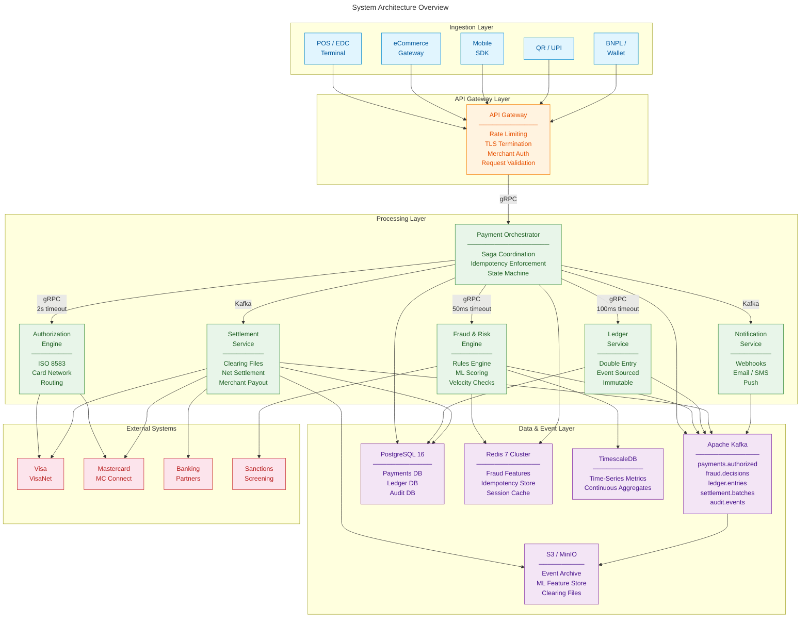

```mermaid
---
title: System Architecture Overview
---
graph TB
    subgraph Ingestion["Ingestion Layer"]
        POS["POS / EDC\nTerminal"]
        ECOM["eCommerce\nGateway"]
        MOBILE["Mobile\nSDK"]
        QR["QR / UPI"]
        BNPL["BNPL /\nWallet"]
    end

    subgraph Gateway["API Gateway Layer"]
        AG["API Gateway\n─────────────\nRate Limiting\nTLS Termination\nMerchant Auth\nRequest Validation"]
    end

    subgraph Processing["Processing Layer"]
        PO["Payment Orchestrator\n──────────────────\nSaga Coordination\nIdempotency Enforcement\nState Machine"]
        
        AE["Authorization\nEngine\n─────────\nISO 8583\nCard Network\nRouting"]
        
        FE["Fraud & Risk\nEngine\n─────────\nRules Engine\nML Scoring\nVelocity Checks"]
        
        LS["Ledger\nService\n─────────\nDouble Entry\nEvent Sourced\nImmutable"]
        
        SS["Settlement\nService\n─────────\nClearing Files\nNet Settlement\nMerchant Payout"]
        
        NS["Notification\nService\n─────────\nWebhooks\nEmail / SMS\nPush"]
    end

    subgraph Data["Data & Event Layer"]
        KAFKA["Apache Kafka\n──────────────\npayments.authorized\nfraud.decisions\nledger.entries\nsettlement.batches\naudit.events"]
        
        PG["PostgreSQL 16\n─────────────\nPayments DB\nLedger DB\nAudit DB"]
        
        REDIS["Redis 7 Cluster\n──────────────\nFraud Features\nIdempotency Store\nSession Cache"]
        
        S3["S3 / MinIO\n──────────\nEvent Archive\nML Feature Store\nClearing Files"]
        
        TSDB["TimescaleDB\n───────────\nTime-Series Metrics\nContinuous Aggregates"]
    end

    subgraph External["External Systems"]
        VISA["Visa\nVisaNet"]
        MC["Mastercard\nMC Connect"]
        BANK["Banking\nPartners"]
        SANC["Sanctions\nScreening"]
    end

    POS --> AG
    ECOM --> AG
    MOBILE --> AG
    QR --> AG
    BNPL --> AG

    AG -->|"gRPC"| PO
    PO -->|"gRPC\n50ms timeout"| FE
    PO -->|"gRPC\n2s timeout"| AE
    PO -->|"gRPC\n100ms timeout"| LS
    PO -->|"Kafka"| SS
    PO -->|"Kafka"| NS

    AE --> VISA
    AE --> MC
    SS --> VISA
    SS --> MC
    SS --> BANK
    FE --> SANC

    PO --> KAFKA
    FE --> KAFKA
    LS --> KAFKA
    SS --> KAFKA
    NS --> KAFKA

    PO --> PG
    LS --> PG
    SS --> PG
    FE --> REDIS
    PO --> REDIS
    FE --> TSDB
    SS --> S3
    KAFKA --> S3

    classDef ingestion fill:#e1f5fe,stroke:#0288d1,color:#01579b
    classDef gateway fill:#fff3e0,stroke:#f57c00,color:#e65100
    classDef processing fill:#e8f5e9,stroke:#388e3c,color:#1b5e20
    classDef data fill:#f3e5f5,stroke:#7b1fa2,color:#4a148c
    classDef external fill:#fce4ec,stroke:#c62828,color:#b71c1c

    class POS,ECOM,MOBILE,QR,BNPL ingestion
    class AG gateway
    class PO,AE,FE,LS,SS,NS processing
    class KAFKA,PG,REDIS,S3,TSDB data
    class VISA,MC,BANK,SANC external
```
