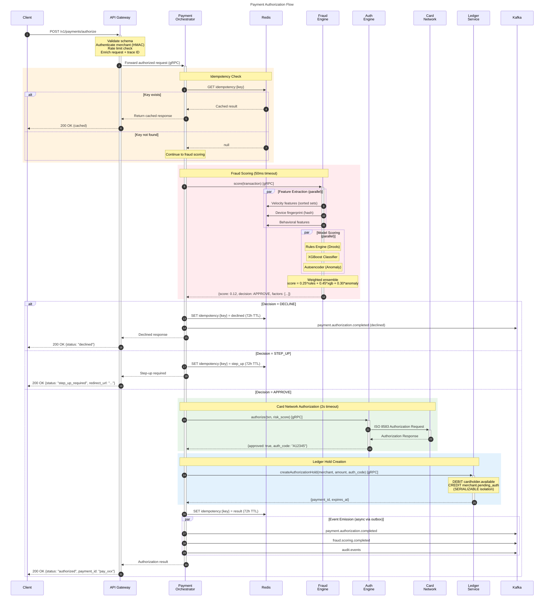

```mermaid
---
title: Payment Authorization Flow
---
sequenceDiagram
    autonumber
    participant Client
    participant AG as API Gateway
    participant PO as Payment<br/>Orchestrator
    participant Redis
    participant FE as Fraud<br/>Engine
    participant AE as Auth<br/>Engine
    participant CN as Card<br/>Network
    participant LS as Ledger<br/>Service
    participant Kafka

    Client->>+AG: POST /v1/payments/authorize
    
    Note over AG: Validate schema<br/>Authenticate merchant (HMAC)<br/>Rate limit check<br/>Enrich request + trace ID
    
    AG->>+PO: Forward authorized request (gRPC)
    
    rect rgb(255, 243, 224)
        Note over PO,Redis: Idempotency Check
        PO->>Redis: GET idempotency:{key}
        alt Key exists
            Redis-->>PO: Cached result
            PO-->>AG: Return cached response
            AG-->>Client: 200 OK (cached)
        else Key not found
            Redis-->>PO: null
            Note over PO: Continue to fraud scoring
        end
    end

    rect rgb(255, 235, 238)
        Note over PO,FE: Fraud Scoring (50ms timeout)
        PO->>+FE: score(transaction) [gRPC]
        
        par Feature Extraction (parallel)
            FE->>Redis: Velocity features (sorted sets)
            FE->>Redis: Device fingerprint (hash)
            FE->>Redis: Behavioral features
        end
        
        par Model Scoring (parallel)
            Note over FE: Rules Engine (Drools)
            Note over FE: XGBoost Classifier
            Note over FE: Autoencoder (Anomaly)
        end
        
        Note over FE: Weighted ensemble<br/>score = 0.25*rules + 0.45*xgb + 0.30*anomaly
        FE-->>-PO: {score: 0.12, decision: APPROVE, factors: [...]}
    end

    alt Decision = DECLINE
        PO->>Redis: SET idempotency:{key} = declined (72h TTL)
        PO->>Kafka: payment.authorization.completed (declined)
        PO-->>AG: Declined response
        AG-->>Client: 200 OK {status: "declined"}
    else Decision = STEP_UP
        PO->>Redis: SET idempotency:{key} = step_up (72h TTL)
        PO-->>AG: Step-up required
        AG-->>Client: 200 OK {status: "step_up_required", redirect_url: "..."}
    else Decision = APPROVE
        rect rgb(232, 245, 233)
            Note over PO,CN: Card Network Authorization (2s timeout)
            PO->>+AE: authorize(txn, risk_score) [gRPC]
            AE->>+CN: ISO 8583 Authorization Request
            CN-->>-AE: Authorization Response
            AE-->>-PO: {approved: true, auth_code: "A12345"}
        end

        rect rgb(227, 242, 253)
            Note over PO,LS: Ledger Hold Creation
            PO->>+LS: createAuthorizationHold(merchant, amount, auth_code) [gRPC]
            Note over LS: DEBIT cardholder.available<br/>CREDIT merchant.pending_auth<br/>(SERIALIZABLE isolation)
            LS-->>-PO: {payment_id, expires_at}
        end

        PO->>Redis: SET idempotency:{key} = result (72h TTL)
        
        par Event Emission (async via outbox)
            PO->>Kafka: payment.authorization.completed
            PO->>Kafka: fraud.scoring.completed
            PO->>Kafka: audit.events
        end

        PO-->>-AG: Authorization result
        AG-->>-Client: 200 OK {status: "authorized", payment_id: "pay_xxx"}
    end
```
