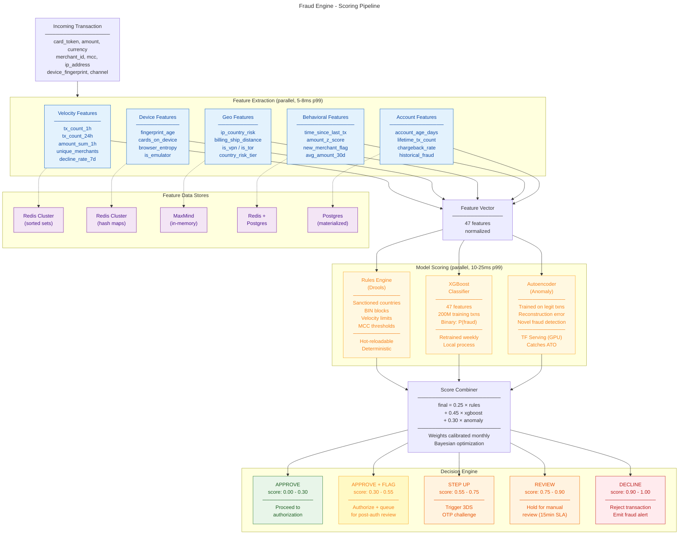

```mermaid
---
title: Fraud Engine - Scoring Pipeline
---
graph TB
    TXN["Incoming Transaction\n──────────────────\ncard_token, amount, currency\nmerchant_id, mcc, ip_address\ndevice_fingerprint, channel"]

    subgraph FeatureExtraction["Feature Extraction (parallel, 5-8ms p99)"]
        direction LR
        VEL["Velocity Features\n─────────────\ntx_count_1h\ntx_count_24h\namount_sum_1h\nunique_merchants\ndecline_rate_7d"]
        DEV["Device Features\n────────────\nfingerprint_age\ncards_on_device\nbrowser_entropy\nis_emulator"]
        GEO["Geo Features\n───────────\nip_country_risk\nbilling_ship_distance\nis_vpn / is_tor\ncountry_risk_tier"]
        BEH["Behavioral Features\n────────────────\ntime_since_last_tx\namount_z_score\nnew_merchant_flag\navg_amount_30d"]
        ACC["Account Features\n───────────────\naccount_age_days\nlifetime_tx_count\nchargeback_rate\nhistorical_fraud"]
    end

    subgraph DataStores["Feature Data Stores"]
        RS1["Redis Cluster\n(sorted sets)"]
        RS2["Redis Cluster\n(hash maps)"]
        MM["MaxMind\n(in-memory)"]
        RS3["Redis +\nPostgres"]
        PG["Postgres\n(materialized)"]
    end

    FV["Feature Vector\n──────────────\n47 features\nnormalized"]

    subgraph ModelScoring["Model Scoring (parallel, 10-25ms p99)"]
        RULES["Rules Engine\n(Drools)\n─────────────\nSanctioned countries\nBIN blocks\nVelocity limits\nMCC thresholds\n─────────────\nHot-reloadable\nDeterministic"]
        XGB["XGBoost\nClassifier\n─────────────\n47 features\n200M training txns\nBinary: P(fraud)\n─────────────\nRetrained weekly\nLocal process"]
        AE["Autoencoder\n(Anomaly)\n─────────────\nTrained on legit txns\nReconstruction error\nNovel fraud detection\n─────────────\nTF Serving (GPU)\nCatches ATO"]
    end

    COMBINE["Score Combiner\n───────────────────────\nfinal = 0.25 × rules\n      + 0.45 × xgboost\n      + 0.30 × anomaly\n───────────────────────\nWeights calibrated monthly\nBayesian optimization"]

    subgraph Decisions["Decision Engine"]
        D_APP["APPROVE\nscore: 0.00 - 0.30\n──────────────\nProceed to\nauthorization"]
        D_FLAG["APPROVE + FLAG\nscore: 0.30 - 0.55\n──────────────\nAuthorize + queue\nfor post-auth review"]
        D_STEP["STEP UP\nscore: 0.55 - 0.75\n──────────────\nTrigger 3DS\nOTP challenge"]
        D_REV["REVIEW\nscore: 0.75 - 0.90\n──────────────\nHold for manual\nreview (15min SLA)"]
        D_DEC["DECLINE\nscore: 0.90 - 1.00\n──────────────\nReject transaction\nEmit fraud alert"]
    end

    TXN --> FeatureExtraction

    VEL -.-> RS1
    DEV -.-> RS2
    GEO -.-> MM
    BEH -.-> RS3
    ACC -.-> PG

    VEL & DEV & GEO & BEH & ACC --> FV
    FV --> RULES & XGB & AE
    RULES & XGB & AE --> COMBINE
    COMBINE --> D_APP & D_FLAG & D_STEP & D_REV & D_DEC

    classDef feature fill:#e3f2fd,stroke:#1565c0,color:#0d47a1
    classDef model fill:#fff8e1,stroke:#f9a825,color:#f57f17
    classDef decision_green fill:#e8f5e9,stroke:#2e7d32,color:#1b5e20
    classDef decision_yellow fill:#fff9c4,stroke:#f9a825,color:#f57f17
    classDef decision_orange fill:#fff3e0,stroke:#ef6c00,color:#e65100
    classDef decision_red fill:#ffebee,stroke:#c62828,color:#b71c1c
    classDef store fill:#f3e5f5,stroke:#7b1fa2,color:#4a148c

    class VEL,DEV,GEO,BEH,ACC feature
    class RULES,XGB,AE model
    class D_APP decision_green
    class D_FLAG decision_yellow
    class D_STEP,D_REV decision_orange
    class D_DEC decision_red
    class RS1,RS2,MM,RS3,PG store
```
