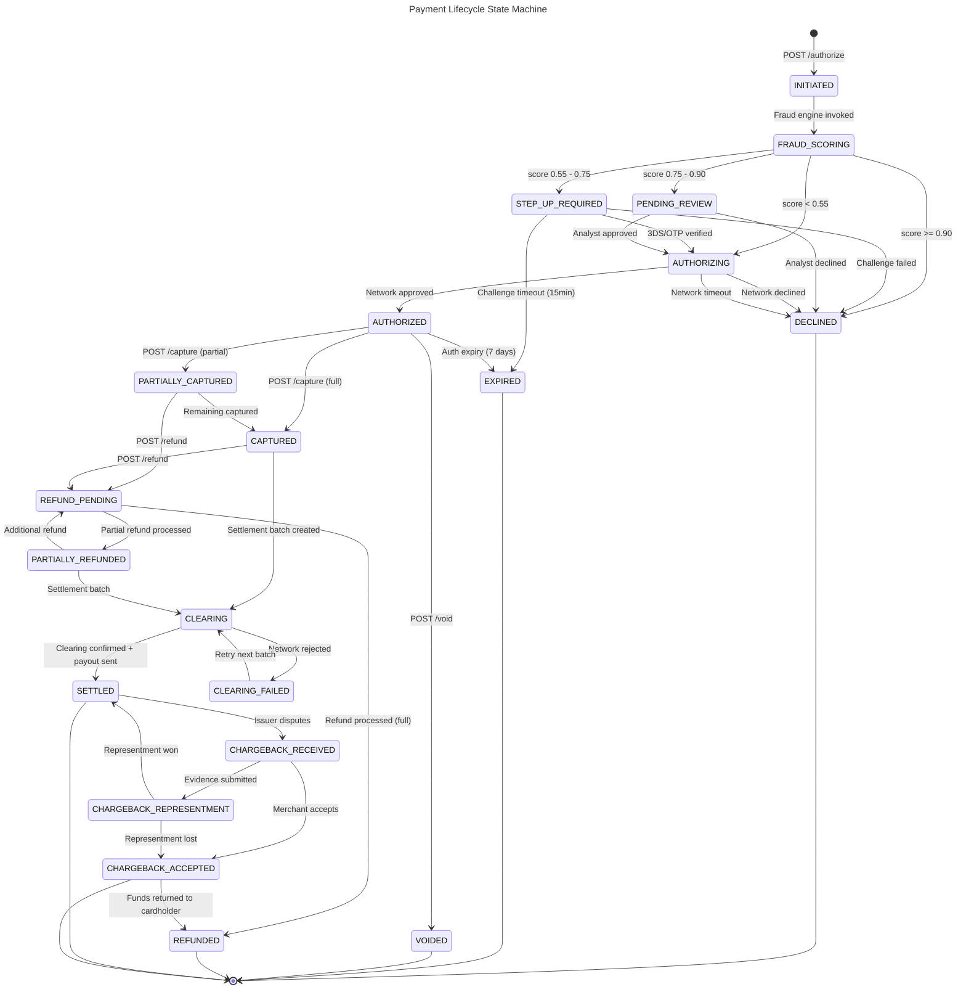

```mermaid
---
title: Payment Lifecycle State Machine
---
stateDiagram-v2
    [*] --> INITIATED: POST /authorize

    INITIATED --> FRAUD_SCORING: Fraud engine invoked
    
    FRAUD_SCORING --> DECLINED: score >= 0.90
    FRAUD_SCORING --> STEP_UP_REQUIRED: score 0.55 - 0.75
    FRAUD_SCORING --> PENDING_REVIEW: score 0.75 - 0.90
    FRAUD_SCORING --> AUTHORIZING: score < 0.55

    STEP_UP_REQUIRED --> AUTHORIZING: 3DS/OTP verified
    STEP_UP_REQUIRED --> DECLINED: Challenge failed
    STEP_UP_REQUIRED --> EXPIRED: Challenge timeout (15min)

    PENDING_REVIEW --> AUTHORIZING: Analyst approved
    PENDING_REVIEW --> DECLINED: Analyst declined

    AUTHORIZING --> AUTHORIZED: Network approved
    AUTHORIZING --> DECLINED: Network declined
    AUTHORIZING --> DECLINED: Network timeout

    AUTHORIZED --> CAPTURED: POST /capture (full)
    AUTHORIZED --> PARTIALLY_CAPTURED: POST /capture (partial)
    AUTHORIZED --> VOIDED: POST /void
    AUTHORIZED --> EXPIRED: Auth expiry (7 days)

    PARTIALLY_CAPTURED --> CAPTURED: Remaining captured
    PARTIALLY_CAPTURED --> REFUND_PENDING: POST /refund

    CAPTURED --> REFUND_PENDING: POST /refund
    CAPTURED --> CLEARING: Settlement batch created
    
    REFUND_PENDING --> REFUNDED: Refund processed (full)
    REFUND_PENDING --> PARTIALLY_REFUNDED: Partial refund processed

    PARTIALLY_REFUNDED --> REFUND_PENDING: Additional refund
    PARTIALLY_REFUNDED --> CLEARING: Settlement batch

    CLEARING --> SETTLED: Clearing confirmed + payout sent
    CLEARING --> CLEARING_FAILED: Network rejected

    CLEARING_FAILED --> CLEARING: Retry next batch

    SETTLED --> CHARGEBACK_RECEIVED: Issuer disputes
    CHARGEBACK_RECEIVED --> CHARGEBACK_REPRESENTMENT: Evidence submitted
    CHARGEBACK_RECEIVED --> CHARGEBACK_ACCEPTED: Merchant accepts
    CHARGEBACK_REPRESENTMENT --> SETTLED: Representment won
    CHARGEBACK_REPRESENTMENT --> CHARGEBACK_ACCEPTED: Representment lost
    CHARGEBACK_ACCEPTED --> REFUNDED: Funds returned to cardholder

    DECLINED --> [*]
    EXPIRED --> [*]
    VOIDED --> [*]
    REFUNDED --> [*]
    SETTLED --> [*]
    CHARGEBACK_ACCEPTED --> [*]
```
