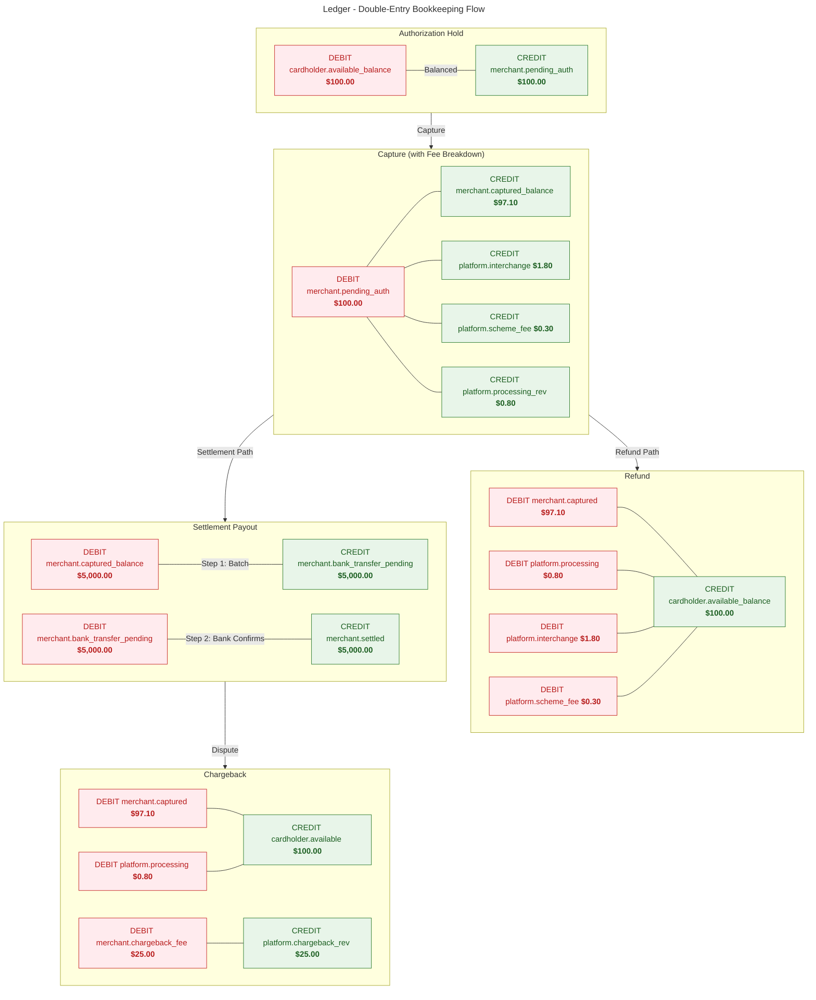

```mermaid
---
title: Ledger - Double-Entry Bookkeeping Flow
---
graph TB
    subgraph AuthHold["Authorization Hold"]
        AH_D["DEBIT<br/>cardholder.available_balance<br/><b>$100.00</b>"]
        AH_C["CREDIT<br/>merchant.pending_auth<br/><b>$100.00</b>"]
        AH_D ---|"Balanced"| AH_C
    end

    subgraph Capture["Capture (with Fee Breakdown)"]
        CAP_D["DEBIT<br/>merchant.pending_auth<br/><b>$100.00</b>"]
        CAP_C1["CREDIT merchant.captured_balance <b>$97.10</b>"]
        CAP_C2["CREDIT platform.interchange <b>$1.80</b>"]
        CAP_C3["CREDIT platform.scheme_fee <b>$0.30</b>"]
        CAP_C4["CREDIT platform.processing_rev <b>$0.80</b>"]
        CAP_D --- CAP_C1
        CAP_D --- CAP_C2
        CAP_D --- CAP_C3
        CAP_D --- CAP_C4
    end

    subgraph Refund["Refund"]
        REF_D1["DEBIT merchant.captured <b>$97.10</b>"]
        REF_D2["DEBIT platform.processing <b>$0.80</b>"]
        REF_D3["DEBIT platform.interchange <b>$1.80</b>"]
        REF_D4["DEBIT platform.scheme_fee <b>$0.30</b>"]
        REF_C["CREDIT<br/>cardholder.available_balance<br/><b>$100.00</b>"]
        REF_D1 --- REF_C
        REF_D2 --- REF_C
        REF_D3 --- REF_C
        REF_D4 --- REF_C
    end

    subgraph Settlement["Settlement Payout"]
        SET_D["DEBIT<br/>merchant.captured_balance<br/><b>$5,000.00</b>"]
        SET_C1["CREDIT<br/>merchant.bank_transfer_pending<br/><b>$5,000.00</b>"]
        SET_D ---|"Step 1: Batch"| SET_C1

        SET_D2["DEBIT<br/>merchant.bank_transfer_pending<br/><b>$5,000.00</b>"]
        SET_C2["CREDIT<br/>merchant.settled<br/><b>$5,000.00</b>"]
        SET_D2 ---|"Step 2: Bank Confirms"| SET_C2
    end

    subgraph Chargeback["Chargeback"]
        CB_D1["DEBIT merchant.captured <b>$97.10</b>"]
        CB_D2["DEBIT platform.processing <b>$0.80</b>"]
        CB_C1["CREDIT cardholder.available <b>$100.00</b>"]
        CB_D3["DEBIT merchant.chargeback_fee <b>$25.00</b>"]
        CB_C2["CREDIT platform.chargeback_rev <b>$25.00</b>"]
        CB_D1 --- CB_C1
        CB_D2 --- CB_C1
        CB_D3 --- CB_C2
    end

    AuthHold -->|"Capture"| Capture
    Capture -->|"Refund Path"| Refund
    Capture -->|"Settlement Path"| Settlement
    Settlement -->|"Dispute"| Chargeback

    classDef debit fill:#ffebee,stroke:#c62828,color:#b71c1c
    classDef credit fill:#e8f5e9,stroke:#2e7d32,color:#1b5e20

    class AH_D,CAP_D,REF_D1,REF_D2,REF_D3,REF_D4,SET_D,SET_D2,CB_D1,CB_D2,CB_D3 debit
    class AH_C,CAP_C1,CAP_C2,CAP_C3,CAP_C4,REF_C,SET_C1,SET_C2,CB_C1,CB_C2 credit
```
