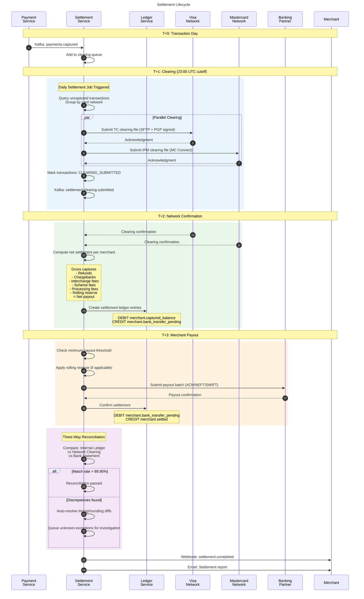

```mermaid
---
title: Settlement Lifecycle
---
sequenceDiagram
    autonumber
    participant PS as Payment<br/>Service
    participant SS as Settlement<br/>Service
    participant LS as Ledger<br/>Service
    participant VN as Visa<br/>Network
    participant MC as Mastercard<br/>Network
    participant BP as Banking<br/>Partner
    participant MER as Merchant

    Note over PS,MER: T+0: Transaction Day

    PS->>SS: Kafka: payments.captured
    SS->>SS: Add to clearing queue

    Note over PS,MER: T+1: Clearing (23:00 UTC cutoff)

    rect rgb(232, 245, 253)
        Note over SS: Daily Settlement Job Triggered
        SS->>SS: Query uncaptured transactions<br/>Group by card network
        
        par Parallel Clearing
            SS->>VN: Submit TC clearing file (SFTP + PGP signed)
            VN-->>SS: Acknowledgment
            SS->>MC: Submit IPM clearing file (MC Connect)
            MC-->>SS: Acknowledgment
        end
        
        SS->>SS: Mark transactions: CLEARING_SUBMITTED
        SS->>SS: Kafka: settlement.clearing.submitted
    end

    Note over PS,MER: T+2: Network Confirmation

    rect rgb(232, 245, 233)
        VN-->>SS: Clearing confirmation
        MC-->>SS: Clearing confirmation
        
        SS->>SS: Compute net settlement per merchant
        Note over SS: Gross captures<br/>- Refunds<br/>- Chargebacks<br/>- Interchange fees<br/>- Scheme fees<br/>- Processing fees<br/>- Rolling reserve<br/>= Net payout
        
        SS->>LS: Create settlement ledger entries
        Note over LS: DEBIT merchant.captured_balance<br/>CREDIT merchant.bank_transfer_pending
    end

    Note over PS,MER: T+3: Merchant Payout

    rect rgb(255, 243, 224)
        SS->>SS: Check minimum payout threshold
        SS->>SS: Apply rolling reserve (if applicable)
        SS->>BP: Submit payout batch (ACH/NEFT/SWIFT)
        BP-->>SS: Payout confirmation
        
        SS->>LS: Confirm settlement
        Note over LS: DEBIT merchant.bank_transfer_pending<br/>CREDIT merchant.settled
    end

    rect rgb(243, 229, 245)
        Note over SS: Three-Way Reconciliation
        SS->>SS: Compare: Internal Ledger<br/>vs Network Clearing<br/>vs Bank Statement
        
        alt Match rate > 99.95%
            SS->>SS: Reconciliation passed
        else Discrepancies found
            SS->>SS: Auto-resolve timing/rounding diffs
            SS->>SS: Queue unknown exceptions for investigation
        end
    end

    SS->>MER: Webhook: settlement.completed
    SS->>MER: Email: Settlement report
```
