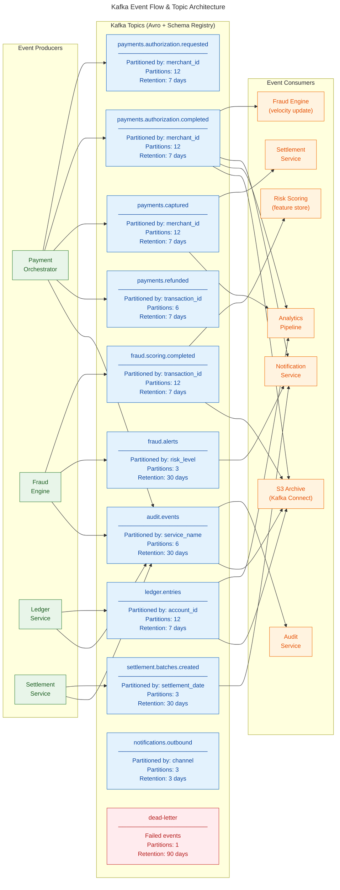

```mermaid
---
title: Kafka Event Flow & Topic Architecture
---
graph LR
    subgraph Producers["Event Producers"]
        PO["Payment\nOrchestrator"]
        FE["Fraud\nEngine"]
        LS["Ledger\nService"]
        SS["Settlement\nService"]
    end

    subgraph Topics["Kafka Topics (Avro + Schema Registry)"]
        T1["payments.authorization.requested\n─────────────────────\nPartitioned by: merchant_id\nPartitions: 12\nRetention: 7 days"]
        T2["payments.authorization.completed\n─────────────────────\nPartitioned by: merchant_id\nPartitions: 12\nRetention: 7 days"]
        T3["payments.captured\n─────────────────────\nPartitioned by: merchant_id\nPartitions: 12\nRetention: 7 days"]
        T4["payments.refunded\n─────────────────────\nPartitioned by: transaction_id\nPartitions: 6\nRetention: 7 days"]
        T5["fraud.scoring.completed\n─────────────────────\nPartitioned by: transaction_id\nPartitions: 12\nRetention: 7 days"]
        T6["fraud.alerts\n─────────────────────\nPartitioned by: risk_level\nPartitions: 3\nRetention: 30 days"]
        T7["ledger.entries\n─────────────────────\nPartitioned by: account_id\nPartitions: 12\nRetention: 7 days"]
        T8["settlement.batches.created\n─────────────────────\nPartitioned by: settlement_date\nPartitions: 3\nRetention: 30 days"]
        T9["audit.events\n─────────────────────\nPartitioned by: service_name\nPartitions: 6\nRetention: 30 days"]
        T10["notifications.outbound\n─────────────────────\nPartitioned by: channel\nPartitions: 3\nRetention: 3 days"]
        DLQ["dead-letter\n─────────────────────\nFailed events\nPartitions: 1\nRetention: 90 days"]
    end

    subgraph Consumers["Event Consumers"]
        FE2["Fraud Engine\n(velocity update)"]
        RS["Risk Scoring\n(feature store)"]
        SS2["Settlement\nService"]
        NS["Notification\nService"]
        AUD["Audit\nService"]
        AN["Analytics\nPipeline"]
        S3["S3 Archive\n(Kafka Connect)"]
    end

    PO --> T1
    PO --> T2
    PO --> T3
    PO --> T4
    FE --> T5
    FE --> T6
    LS --> T7
    SS --> T8
    PO & FE & LS & SS --> T9

    T2 --> FE2
    T2 --> NS
    T2 --> AN
    T3 --> SS2
    T3 --> AN
    T5 --> RS
    T6 --> NS
    T7 --> AN
    T8 --> NS
    T9 --> AUD
    T2 & T5 & T7 & T9 --> S3

    classDef producer fill:#e8f5e9,stroke:#2e7d32,color:#1b5e20
    classDef topic fill:#e3f2fd,stroke:#1565c0,color:#0d47a1
    classDef consumer fill:#fff3e0,stroke:#ef6c00,color:#e65100
    classDef dlq fill:#ffebee,stroke:#c62828,color:#b71c1c

    class PO,FE,LS,SS producer
    class T1,T2,T3,T4,T5,T6,T7,T8,T9,T10 topic
    class FE2,RS,SS2,NS,AUD,AN,S3 consumer
    class DLQ dlq
```
