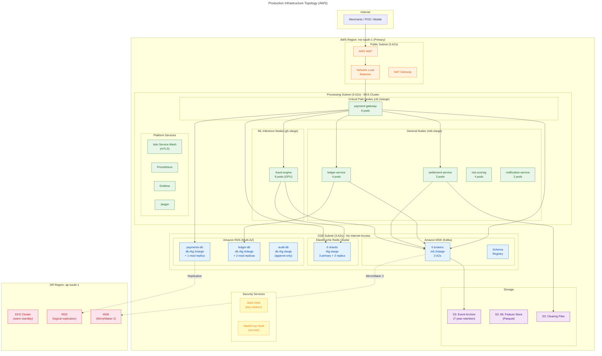

```mermaid
---
title: Production Infrastructure Topology (AWS)
---
graph TB
    subgraph Internet["Internet"]
        CLIENTS["Merchants / POS / Mobile"]
    end

    subgraph AWS["AWS Region: me-south-1 (Primary)"]
        subgraph PublicSubnet["Public Subnet (3 AZs)"]
            WAF["AWS WAF"]
            NLB["Network Load\nBalancer"]
            NAT["NAT Gateway"]
        end

        subgraph ProcessingSubnet["Processing Subnet (3 AZs) - EKS Cluster"]
            subgraph CriticalNodes["Critical Path Nodes (c6i.2xlarge)"]
                PG_PODS["payment-gateway\n6 pods"]
            end
            subgraph MLNodes["ML Inference Nodes (g5.xlarge)"]
                FE_PODS["fraud-engine\n8 pods (GPU)"]
            end
            subgraph GeneralNodes["General Nodes (m6i.xlarge)"]
                LS_PODS["ledger-service\n4 pods"]
                SS_PODS["settlement-service\n3 pods"]
                RS_PODS["risk-scoring\n4 pods"]
                NS_PODS["notification-service\n2 pods"]
            end
            subgraph Platform["Platform Services"]
                ISTIO["Istio Service Mesh\n(mTLS)"]
                PROM["Prometheus"]
                GRAF["Grafana"]
                JAEG["Jaeger"]
            end
        end

        subgraph CDESubnet["CDE Subnet (3 AZs) - No Internet Access"]
            subgraph Databases["Amazon RDS (Multi-AZ)"]
                DB_PAY["payments-db\ndb.r6g.2xlarge\n+ 1 read replica"]
                DB_LED["ledger-db\ndb.r6g.4xlarge\n+ 2 read replicas"]
                DB_AUD["audit-db\ndb.r6g.xlarge\n(append-only)"]
            end
            subgraph Cache["ElastiCache Redis Cluster"]
                REDIS_C["6 shards\nr6g.xlarge\n3 primary + 3 replica"]
            end
            subgraph Streaming["Amazon MSK (Kafka)"]
                MSK["6 brokers\nm5.2xlarge\n3 AZs"]
                SR["Schema\nRegistry"]
            end
        end

        subgraph Storage["Storage"]
            S3_EVT["S3: Event Archive\n(7-year retention)"]
            S3_ML["S3: ML Feature Store\n(Parquet)"]
            S3_CLR["S3: Clearing Files"]
        end

        subgraph Security["Security Services"]
            KMS["AWS KMS\n(key rotation)"]
            VAULT["HashiCorp Vault\n(secrets)"]
        end
    end

    subgraph DR["DR Region: ap-south-1"]
        DR_EKS["EKS Cluster\n(warm standby)"]
        DR_RDS["RDS\n(logical replication)"]
        DR_MSK["MSK\n(MirrorMaker 2)"]
    end

    CLIENTS --> WAF --> NLB
    NLB --> PG_PODS
    PG_PODS --> FE_PODS
    PG_PODS --> LS_PODS
    PG_PODS --> SS_PODS

    PG_PODS --> DB_PAY
    LS_PODS --> DB_LED
    FE_PODS --> REDIS_C
    PG_PODS --> REDIS_C
    PG_PODS --> MSK
    LS_PODS --> MSK
    SS_PODS --> MSK
    FE_PODS --> MSK
    MSK --> S3_EVT
    SS_PODS --> S3_CLR

    DB_PAY -.->|"Replication"| DR_RDS
    MSK -.->|"MirrorMaker 2"| DR_MSK

    classDef public fill:#fff3e0,stroke:#ef6c00,color:#e65100
    classDef processing fill:#e8f5e9,stroke:#2e7d32,color:#1b5e20
    classDef cde fill:#e3f2fd,stroke:#1565c0,color:#0d47a1
    classDef storage fill:#f3e5f5,stroke:#7b1fa2,color:#4a148c
    classDef dr fill:#fce4ec,stroke:#c62828,color:#b71c1c
    classDef security fill:#fff9c4,stroke:#f9a825,color:#f57f17

    class WAF,NLB,NAT public
    class PG_PODS,FE_PODS,LS_PODS,SS_PODS,RS_PODS,NS_PODS,ISTIO,PROM,GRAF,JAEG processing
    class DB_PAY,DB_LED,DB_AUD,REDIS_C,MSK,SR cde
    class S3_EVT,S3_ML,S3_CLR storage
    class DR_EKS,DR_RDS,DR_MSK dr
    class KMS,VAULT security
```
