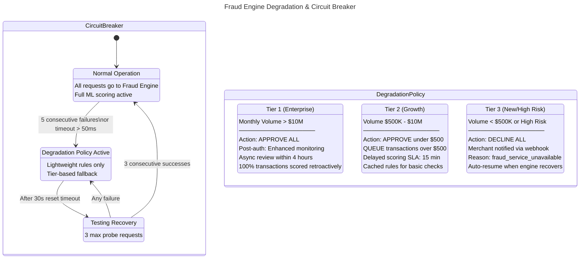

```mermaid
---
title: Fraud Engine Degradation & Circuit Breaker
---
stateDiagram-v2
    state CircuitBreaker {
        [*] --> CLOSED
        
        CLOSED --> OPEN: 5 consecutive failures\nor timeout > 50ms
        CLOSED: Normal Operation
        CLOSED: All requests go to Fraud Engine
        CLOSED: Full ML scoring active
        
        OPEN --> HALF_OPEN: After 30s reset timeout
        OPEN: Degradation Policy Active
        OPEN: Lightweight rules only
        OPEN: Tier-based fallback
        
        HALF_OPEN --> CLOSED: 3 consecutive successes
        HALF_OPEN --> OPEN: Any failure
        HALF_OPEN: Testing Recovery
        HALF_OPEN: 3 max probe requests
    }

    state DegradationPolicy {
        state "Tier 1 (Enterprise)" as T1
        state "Tier 2 (Growth)" as T2
        state "Tier 3 (New/High Risk)" as T3
        
        T1: Monthly Volume > $10M
        T1: ──────────────────
        T1: Action: APPROVE ALL
        T1: Post-auth: Enhanced monitoring
        T1: Async review within 4 hours
        T1: 100% transactions scored retroactively
        
        T2: Volume $500K - $10M
        T2: ──────────────────
        T2: Action: APPROVE under $500
        T2: QUEUE transactions over $500
        T2: Delayed scoring SLA: 15 min
        T2: Cached rules for basic checks
        
        T3: Volume < $500K or High Risk
        T3: ──────────────────
        T3: Action: DECLINE ALL
        T3: Merchant notified via webhook
        T3: Reason: fraud_service_unavailable
        T3: Auto-resume when engine recovers
    }
```
