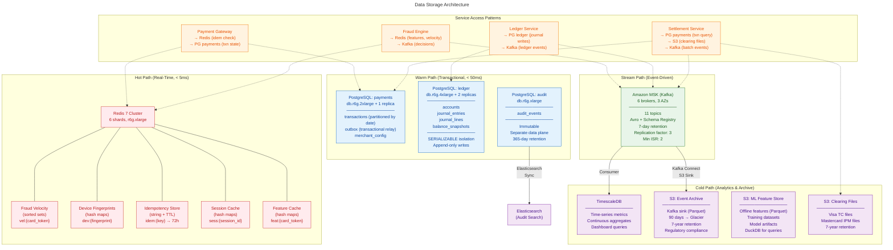

```mermaid
---
title: Data Storage Architecture
---
graph TB
    subgraph HotPath["Hot Path (Real-Time, < 5ms)"]
        REDIS["Redis 7 Cluster\n6 shards, r6g.xlarge"]
        
        R1["Fraud Velocity\n(sorted sets)\nvel:{card_token}"]
        R2["Device Fingerprints\n(hash maps)\ndev:{fingerprint}"]
        R3["Idempotency Store\n(string + TTL)\nidem:{key} → 72h"]
        R4["Session Cache\n(hash maps)\nsess:{session_id}"]
        R5["Feature Cache\n(hash maps)\nfeat:{card_token}"]
        
        REDIS --- R1 & R2 & R3 & R4 & R5
    end

    subgraph WarmPath["Warm Path (Transactional, < 50ms)"]
        PG_PAY["PostgreSQL: payments\ndb.r6g.2xlarge + 1 replica\n────────────────\ntransactions (partitioned by date)\noutbox (transactional relay)\nmerchant_config"]

        PG_LED["PostgreSQL: ledger\ndb.r6g.4xlarge + 2 replicas\n────────────────\naccounts\njournal_entries\njournal_lines\nbalance_snapshots\n────────────────\nSERIALIZABLE isolation\nAppend-only writes"]

        PG_AUD["PostgreSQL: audit\ndb.r6g.xlarge\n────────────────\naudit_events\n────────────────\nImmutable\nSeparate data plane\n365-day retention"]
    end

    subgraph StreamPath["Stream Path (Event-Driven)"]
        KAFKA["Amazon MSK (Kafka)\n6 brokers, 3 AZs\n────────────────\n11 topics\nAvro + Schema Registry\n7-day retention\nReplication factor: 3\nMin ISR: 2"]
    end

    subgraph ColdPath["Cold Path (Analytics & Archive)"]
        TSDB["TimescaleDB\n────────────────\nTime-series metrics\nContinuous aggregates\nDashboard queries"]

        S3_EVT["S3: Event Archive\n────────────────\nKafka sink (Parquet)\n90 days → Glacier\n7-year retention\nRegulatory compliance"]

        S3_ML["S3: ML Feature Store\n────────────────\nOffline features (Parquet)\nTraining datasets\nModel artifacts\nDuckDB for queries"]

        S3_CLR["S3: Clearing Files\n────────────────\nVisa TC files\nMastercard IPM files\n7-year retention"]
    end

    subgraph Services["Service Access Patterns"]
        SVC_GW["Payment Gateway\n→ Redis (idem check)\n→ PG payments (txn state)"]
        SVC_FE["Fraud Engine\n→ Redis (features, velocity)\n→ Kafka (decisions)"]
        SVC_LS["Ledger Service\n→ PG ledger (journal writes)\n→ Kafka (ledger events)"]
        SVC_SS["Settlement Service\n→ PG payments (txn query)\n→ S3 (clearing files)\n→ Kafka (batch events)"]
    end

    SVC_GW -.-> REDIS
    SVC_GW -.-> PG_PAY
    SVC_FE -.-> REDIS
    SVC_FE -.-> KAFKA
    SVC_LS -.-> PG_LED
    SVC_LS -.-> KAFKA
    SVC_SS -.-> PG_PAY
    SVC_SS -.-> S3_CLR
    SVC_SS -.-> KAFKA
    
    KAFKA -->|"Kafka Connect\nS3 Sink"| S3_EVT
    KAFKA -->|"Consumer"| TSDB
    PG_AUD -->|"Elasticsearch\nSync"| ES["Elasticsearch\n(Audit Search)"]

    classDef hot fill:#ffebee,stroke:#c62828,color:#b71c1c
    classDef warm fill:#e3f2fd,stroke:#1565c0,color:#0d47a1
    classDef stream fill:#e8f5e9,stroke:#2e7d32,color:#1b5e20
    classDef cold fill:#f3e5f5,stroke:#7b1fa2,color:#4a148c
    classDef svc fill:#fff3e0,stroke:#ef6c00,color:#e65100

    class REDIS,R1,R2,R3,R4,R5 hot
    class PG_PAY,PG_LED,PG_AUD warm
    class KAFKA stream
    class TSDB,S3_EVT,S3_ML,S3_CLR,ES cold
    class SVC_GW,SVC_FE,SVC_LS,SVC_SS svc
```
