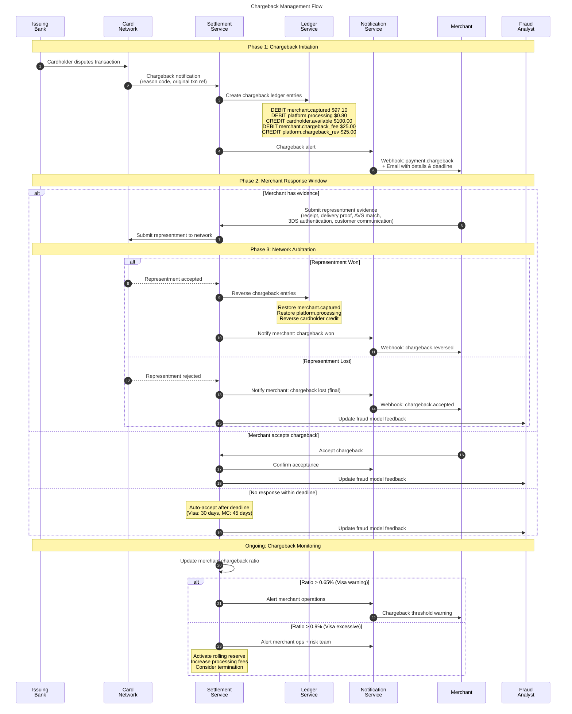

```mermaid
---
title: Chargeback Management Flow
---
sequenceDiagram
    autonumber
    participant ISS as Issuing<br/>Bank
    participant CN as Card<br/>Network
    participant SS as Settlement<br/>Service
    participant LS as Ledger<br/>Service
    participant NS as Notification<br/>Service
    participant MER as Merchant
    participant FA as Fraud<br/>Analyst

    Note over ISS,FA: Phase 1: Chargeback Initiation

    ISS->>CN: Cardholder disputes transaction
    CN->>SS: Chargeback notification<br/>(reason code, original txn ref)
    
    SS->>LS: Create chargeback ledger entries
    Note over LS: DEBIT merchant.captured $97.10<br/>DEBIT platform.processing $0.80<br/>CREDIT cardholder.available $100.00<br/>DEBIT merchant.chargeback_fee $25.00<br/>CREDIT platform.chargeback_rev $25.00

    SS->>NS: Chargeback alert
    NS->>MER: Webhook: payment.chargeback<br/>+ Email with details & deadline

    Note over ISS,FA: Phase 2: Merchant Response Window

    alt Merchant has evidence
        MER->>SS: Submit representment evidence<br/>(receipt, delivery proof, AVS match,<br/>3DS authentication, customer communication)
        SS->>CN: Submit representment to network
        
        Note over ISS,FA: Phase 3: Network Arbitration

        alt Representment Won
            CN-->>SS: Representment accepted
            SS->>LS: Reverse chargeback entries
            Note over LS: Restore merchant.captured<br/>Restore platform.processing<br/>Reverse cardholder credit
            SS->>NS: Notify merchant: chargeback won
            NS->>MER: Webhook: chargeback.reversed
        else Representment Lost
            CN-->>SS: Representment rejected
            SS->>NS: Notify merchant: chargeback lost (final)
            NS->>MER: Webhook: chargeback.accepted
            SS->>FA: Update fraud model feedback
        end
    else Merchant accepts chargeback
        MER->>SS: Accept chargeback
        SS->>NS: Confirm acceptance
        SS->>FA: Update fraud model feedback
    else No response within deadline
        Note over SS: Auto-accept after deadline<br/>(Visa: 30 days, MC: 45 days)
        SS->>FA: Update fraud model feedback
    end

    Note over ISS,FA: Ongoing: Chargeback Monitoring

    SS->>SS: Update merchant chargeback ratio
    
    alt Ratio > 0.65% (Visa warning)
        SS->>NS: Alert merchant operations
        NS->>MER: Chargeback threshold warning
    else Ratio > 0.9% (Visa excessive)
        SS->>NS: Alert merchant ops + risk team
        Note over SS: Activate rolling reserve<br/>Increase processing fees<br/>Consider termination
    end
```
