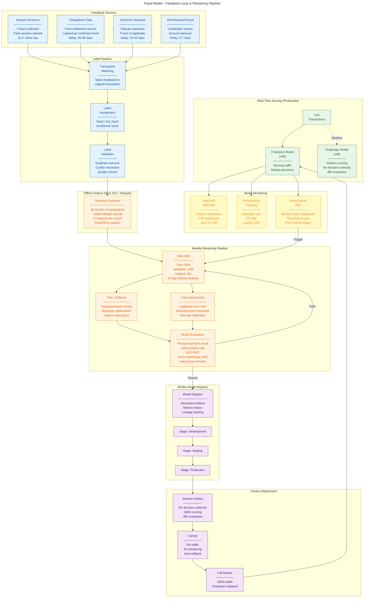

```mermaid
---
title: Fraud Model - Feedback Loop & Retraining Pipeline
---
graph TB
    subgraph RealTime["Real-Time Scoring (Production)"]
        TXN["Live\nTransactions"]
        CHAMP["Champion Model\n(v48)\n─────────\nServing traffic\nMaking decisions"]
        CHALL["Challenger Model\n(v49)\n─────────\nShadow scoring\nNo decision authority\n48h evaluation"]
        
        TXN --> CHAMP
        TXN -.->|"Shadow"| CHALL
    end

    subgraph FeedbackSources["Feedback Sources"]
        AN_DEC["Analyst Decisions\n─────────────\nFraud confirmed\nFalse positive cleared\nSLA: same day"]
        CB_DATA["Chargeback Data\n─────────────\nFrom settlement service\nLabeled as confirmed fraud\nDelay: 30-90 days"]
        CUST_DISP["Customer Disputes\n─────────────\nDispute resolution\nFraud vs legitimate\nDelay: 15-45 days"]
        SELF_RPT["Self-Reported Fraud\n─────────────\nCardholder reports\nAccount takeover\nDelay: 0-7 days"]
    end

    subgraph LabelPipeline["Label Pipeline"]
        MATCH["Transaction\nMatching\n─────────\nMatch feedback to\noriginal transaction"]
        LABEL["Label\nAssignment\n─────────\nfraud / not_fraud\nconfidence score"]
        VALIDATE["Label\nValidation\n─────────\nDuplicate removal\nConflict resolution\nQuality checks"]
    end

    subgraph FeatureStore["Offline Feature Store (S3 + Parquet)"]
        HIST["Historical Features\n─────────────────\n18 months of transactions\n~200M labeled records\n47 features per record\nDuckDB for queries"]
    end

    subgraph TrainingPipeline["Weekly Retraining Pipeline"]
        SPLIT["Data Split\n─────────\nTrain: 80%\nValidation: 15%\nHoldout: 5%\n(3-day holdout window)"]
        
        TRAIN_XGB["Train XGBoost\n─────────────\nHyperparameter tuning\nBayesian optimization\nFeature importance"]
        
        TRAIN_AE["Train Autoencoder\n─────────────\nLegitimate txns only\nReconstruction threshold\nAnomaly calibration"]

        EVAL["Model Evaluation\n────────────────\nPrecision @ 95% recall\nFalse positive rate\nAUC-ROC\nScore distribution shift\nLatency benchmarks"]
    end

    subgraph Registry["MLflow Model Registry"]
        REG["Model Registry\n──────────────\nVersioned artifacts\nMetrics history\nLineage tracking"]
        
        STAGE_DEV["Stage: Development"]
        STAGE_STAG["Stage: Staging"]
        STAGE_PROD["Stage: Production"]
    end

    subgraph Deployment["Canary Deployment"]
        DEP_SHADOW["Shadow Deploy\n─────────\n0% decision authority\n100% scoring\n48h evaluation"]
        DEP_CANARY["Canary\n─────────\n5% traffic\n2h monitoring\nAuto-rollback"]
        DEP_FULL["Full Rollout\n─────────\n100% traffic\nChampion replaced"]
    end

    subgraph Monitoring["Model Monitoring"]
        DRIFT["Data Drift\nDetection\n─────────\nFeature distribution\nPSI monitoring\nAlert on shift"]
        PERF["Performance\nTracking\n─────────\nDetection rate\nFP rate\nLatency p99"]
        DECAY["Model Decay\nAlert\n─────────\nWeekly score comparison\nThreshold breach\nForce retrain trigger"]
    end

    AN_DEC & CB_DATA & CUST_DISP & SELF_RPT --> MATCH
    MATCH --> LABEL --> VALIDATE
    VALIDATE --> HIST

    HIST --> SPLIT
    SPLIT --> TRAIN_XGB & TRAIN_AE
    TRAIN_XGB & TRAIN_AE --> EVAL

    EVAL -->|"Passes"| REG
    EVAL -->|"Fails"| SPLIT

    REG --> STAGE_DEV --> STAGE_STAG --> STAGE_PROD

    STAGE_PROD --> DEP_SHADOW --> DEP_CANARY --> DEP_FULL
    DEP_FULL --> CHAMP

    CHAMP --> DRIFT & PERF & DECAY
    DECAY -->|"Trigger"| SPLIT

    classDef realtime fill:#e8f5e9,stroke:#2e7d32,color:#1b5e20
    classDef feedback fill:#e3f2fd,stroke:#1565c0,color:#0d47a1
    classDef pipeline fill:#fff3e0,stroke:#ef6c00,color:#e65100
    classDef registry fill:#f3e5f5,stroke:#7b1fa2,color:#4a148c
    classDef monitor fill:#fff9c4,stroke:#f9a825,color:#f57f17

    class TXN,CHAMP,CHALL realtime
    class AN_DEC,CB_DATA,CUST_DISP,SELF_RPT,MATCH,LABEL,VALIDATE feedback
    class SPLIT,TRAIN_XGB,TRAIN_AE,EVAL,HIST pipeline
    class REG,STAGE_DEV,STAGE_STAG,STAGE_PROD,DEP_SHADOW,DEP_CANARY,DEP_FULL registry
    class DRIFT,PERF,DECAY monitor
```
