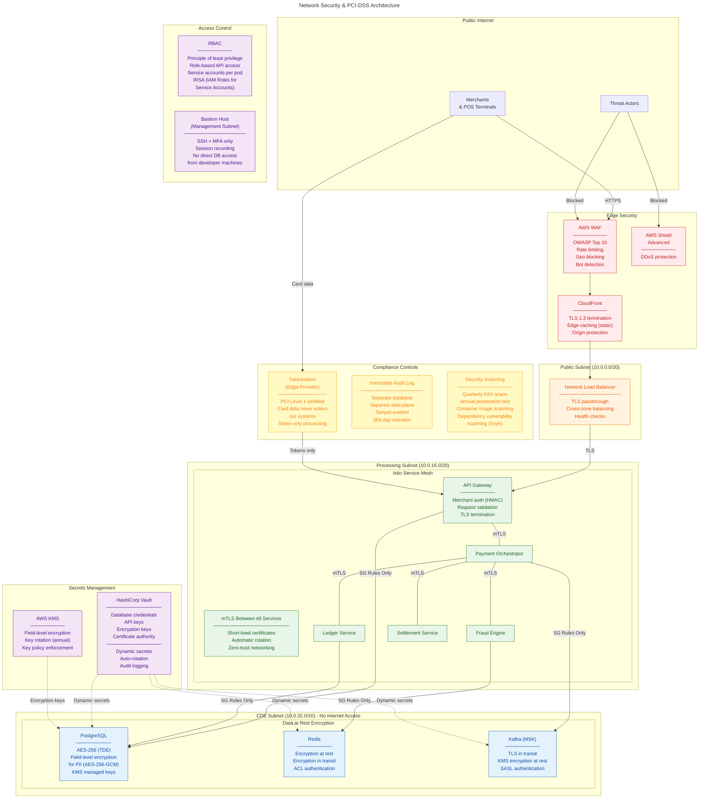

```mermaid
---
title: Network Security & PCI-DSS Architecture
---
graph TB
    subgraph Internet["Public Internet"]
        MER["Merchants\n& POS Terminals"]
        ATK["Threat Actors"]
    end

    subgraph Edge["Edge Security"]
        WAF["AWS WAF\n──────────\nOWASP Top 10\nRate limiting\nGeo blocking\nBot detection"]
        SHIELD["AWS Shield\nAdvanced\n──────────\nDDoS protection"]
        CF["CloudFront\n──────────\nTLS 1.3 termination\nEdge caching (static)\nOrigin protection"]
    end

    subgraph PublicSubnet["Public Subnet (10.0.0.0/20)"]
        NLB["Network Load Balancer\n──────────────────\nTLS passthrough\nCross-zone balancing\nHealth checks"]
    end

    subgraph ProcessingSubnet["Processing Subnet (10.0.16.0/20)"]
        subgraph ServiceMesh["Istio Service Mesh"]
            SM_MTLS["mTLS Between All Services\n──────────────────────\nShort-lived certificates\nAutomatic rotation\nZero-trust networking"]
            
            AG["API Gateway\n──────────\nMerchant auth (HMAC)\nRequest validation\nTLS termination"]
            PO["Payment Orchestrator"]
            FE["Fraud Engine"]
            LS["Ledger Service"]
            SS["Settlement Service"]
        end
    end

    subgraph CDESubnet["CDE Subnet (10.0.32.0/20) - No Internet Access"]
        subgraph DataEncryption["Data at Rest Encryption"]
            PG["PostgreSQL\n──────────\nAES-256 (TDE)\nField-level encryption\nfor PII (AES-256-GCM)\nKMS managed keys"]
            REDIS_SEC["Redis\n──────────\nEncryption at rest\nEncryption in transit\nACL authentication"]
            KAFKA_SEC["Kafka (MSK)\n──────────\nTLS in transit\nKMS encryption at rest\nSASL authentication"]
        end
    end

    subgraph SecretsManagement["Secrets Management"]
        VAULT["HashiCorp Vault\n────────────────\nDatabase credentials\nAPI keys\nEncryption keys\nCertificate authority\n────────────────\nDynamic secrets\nAuto-rotation\nAudit logging"]
        KMS["AWS KMS\n──────────\nField-level encryption\nKey rotation (annual)\nKey policy enforcement"]
    end

    subgraph Compliance["Compliance Controls"]
        TOKEN["Tokenization\n(Edge Provider)\n──────────────\nPCI Level 1 certified\nCard data never enters\nour systems\nToken-only processing"]
        AUDIT_LOG["Immutable Audit Log\n──────────────────\nSeparate database\nSeparate data plane\nTamper-evident\n365-day retention"]
        SCAN["Security Scanning\n────────────────\nQuarterly ASV scans\nAnnual penetration test\nContainer image scanning\nDependency vulnerability\nscanning (Snyk)"]
    end

    subgraph AccessControl["Access Control"]
        RBAC["RBAC\n──────────\nPrinciple of least privilege\nRole-based API access\nService accounts per pod\nIRSA (IAM Roles for\nService Accounts)"]
        BASTION["Bastion Host\n(Management Subnet)\n──────────────────\nSSH + MFA only\nSession recording\nNo direct DB access\nfrom developer machines"]
    end

    MER -->|"HTTPS"| WAF
    ATK -->|"Blocked"| WAF
    ATK -->|"Blocked"| SHIELD
    WAF --> CF --> NLB
    NLB -->|"TLS"| AG
    
    AG ---|"mTLS"| PO
    PO ---|"mTLS"| FE
    PO ---|"mTLS"| LS
    PO ---|"mTLS"| SS

    AG -->|"SG Rules Only"| PG
    LS -->|"SG Rules Only"| PG
    FE -->|"SG Rules Only"| REDIS_SEC
    PO -->|"SG Rules Only"| KAFKA_SEC

    VAULT -.->|"Dynamic secrets"| PG & REDIS_SEC & KAFKA_SEC
    KMS -.->|"Encryption keys"| PG

    MER -->|"Card data"| TOKEN
    TOKEN -->|"Tokens only"| AG

    classDef edge fill:#ffebee,stroke:#c62828,color:#b71c1c
    classDef public fill:#fff3e0,stroke:#ef6c00,color:#e65100
    classDef processing fill:#e8f5e9,stroke:#2e7d32,color:#1b5e20
    classDef cde fill:#e3f2fd,stroke:#1565c0,color:#0d47a1
    classDef security fill:#f3e5f5,stroke:#7b1fa2,color:#4a148c
    classDef compliance fill:#fff9c4,stroke:#f9a825,color:#f57f17

    class WAF,SHIELD,CF edge
    class NLB public
    class SM_MTLS,AG,PO,FE,LS,SS processing
    class PG,REDIS_SEC,KAFKA_SEC cde
    class VAULT,KMS,RBAC,BASTION security
    class TOKEN,AUDIT_LOG,SCAN compliance
```
