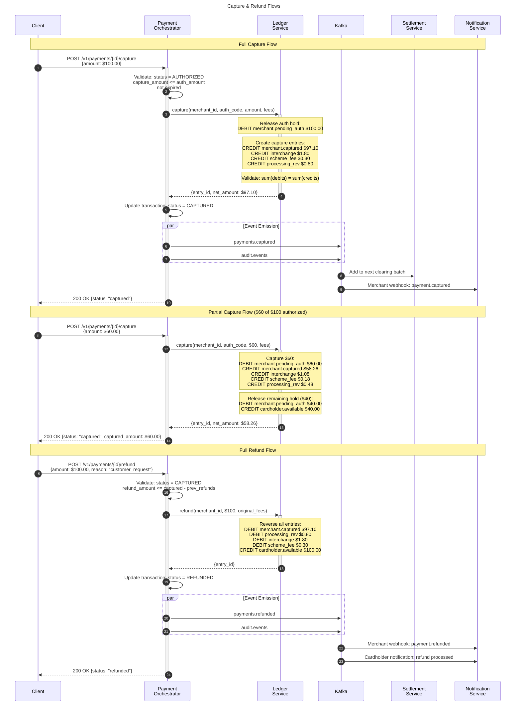

```mermaid
---
title: Capture & Refund Flows
---
sequenceDiagram
    autonumber
    participant Client
    participant PO as Payment<br/>Orchestrator
    participant LS as Ledger<br/>Service
    participant Kafka
    participant SS as Settlement<br/>Service
    participant NS as Notification<br/>Service

    Note over Client,NS: Full Capture Flow

    Client->>+PO: POST /v1/payments/{id}/capture<br/>{amount: $100.00}
    
    PO->>PO: Validate: status = AUTHORIZED<br/>capture_amount <= auth_amount<br/>not expired
    
    PO->>+LS: capture(merchant_id, auth_code, amount, fees)
    
    Note over LS: Release auth hold:<br/>DEBIT merchant.pending_auth $100.00
    Note over LS: Create capture entries:<br/>CREDIT merchant.captured $97.10<br/>CREDIT interchange $1.80<br/>CREDIT scheme_fee $0.30<br/>CREDIT processing_rev $0.80
    Note over LS: Validate: sum(debits) = sum(credits)
    
    LS-->>-PO: {entry_id, net_amount: $97.10}
    
    PO->>PO: Update transaction: status = CAPTURED
    
    par Event Emission
        PO->>Kafka: payments.captured
        PO->>Kafka: audit.events
    end
    
    Kafka->>SS: Add to next clearing batch
    Kafka->>NS: Merchant webhook: payment.captured
    
    PO-->>-Client: 200 OK {status: "captured"}

    Note over Client,NS: Partial Capture Flow ($60 of $100 authorized)

    Client->>+PO: POST /v1/payments/{id}/capture<br/>{amount: $60.00}
    
    PO->>+LS: capture(merchant_id, auth_code, $60, fees)
    
    Note over LS: Capture $60:<br/>DEBIT merchant.pending_auth $60.00<br/>CREDIT merchant.captured $58.26<br/>CREDIT interchange $1.08<br/>CREDIT scheme_fee $0.18<br/>CREDIT processing_rev $0.48
    Note over LS: Release remaining hold ($40):<br/>DEBIT merchant.pending_auth $40.00<br/>CREDIT cardholder.available $40.00
    
    LS-->>-PO: {entry_id, net_amount: $58.26}
    PO-->>-Client: 200 OK {status: "captured", captured_amount: $60.00}

    Note over Client,NS: Full Refund Flow

    Client->>+PO: POST /v1/payments/{id}/refund<br/>{amount: $100.00, reason: "customer_request"}
    
    PO->>PO: Validate: status = CAPTURED<br/>refund_amount <= captured - prev_refunds
    
    PO->>+LS: refund(merchant_id, $100, original_fees)
    
    Note over LS: Reverse all entries:<br/>DEBIT merchant.captured $97.10<br/>DEBIT processing_rev $0.80<br/>DEBIT interchange $1.80<br/>DEBIT scheme_fee $0.30<br/>CREDIT cardholder.available $100.00
    
    LS-->>-PO: {entry_id}
    
    PO->>PO: Update transaction: status = REFUNDED
    
    par Event Emission
        PO->>Kafka: payments.refunded
        PO->>Kafka: audit.events
    end
    
    Kafka->>NS: Merchant webhook: payment.refunded
    Kafka->>NS: Cardholder notification: refund processed
    
    PO-->>-Client: 200 OK {status: "refunded"}
```
