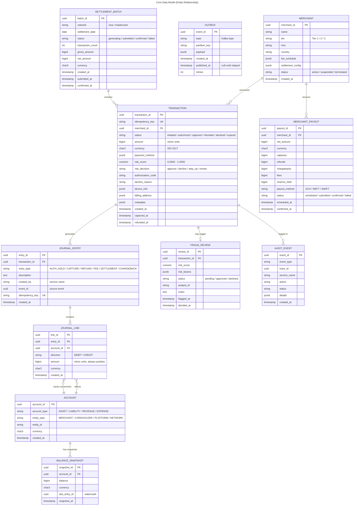

```mermaid
---
title: Core Data Model (Entity Relationship)
---
erDiagram
    MERCHANT {
        uuid merchant_id PK
        string name
        string tier "Tier 1 / 2 / 3"
        string mcc
        string country
        jsonb fee_schedule
        jsonb settlement_config
        string status "active / suspended / terminated"
        timestamp created_at
    }

    TRANSACTION {
        uuid transaction_id PK
        string idempotency_key UK
        uuid merchant_id FK
        string status "initiated / authorized / captured / refunded / declined / expired"
        bigint amount "minor units"
        char3 currency "ISO 4217"
        jsonb payment_method
        numeric risk_score "0.0000 - 1.0000"
        string risk_decision "approve / decline / step_up / review"
        string authorization_code
        string decline_reason
        jsonb device_info
        jsonb billing_address
        jsonb metadata
        timestamp created_at
        timestamp captured_at
        timestamp refunded_at
    }

    ACCOUNT {
        uuid account_id PK
        string account_type "ASSET / LIABILITY / REVENUE / EXPENSE"
        string entity_type "MERCHANT / CARDHOLDER / PLATFORM / NETWORK"
        string entity_id
        char3 currency
        timestamp created_at
    }

    JOURNAL_ENTRY {
        uuid entry_id PK
        uuid transaction_id FK
        string entry_type "AUTH_HOLD / CAPTURE / REFUND / FEE / SETTLEMENT / CHARGEBACK"
        text description
        string created_by "service name"
        uuid event_id "source event"
        string idempotency_key UK
        timestamp created_at
    }

    JOURNAL_LINE {
        uuid line_id PK
        uuid entry_id FK
        uuid account_id FK
        string direction "DEBIT / CREDIT"
        bigint amount "minor units, always positive"
        char3 currency
        timestamp created_at
    }

    BALANCE_SNAPSHOT {
        uuid snapshot_id PK
        uuid account_id FK
        bigint balance
        char3 currency
        uuid last_entry_id "watermark"
        timestamp snapshot_at
    }

    OUTBOX {
        uuid event_id PK
        string topic "Kafka topic"
        string partition_key
        jsonb payload
        timestamp created_at
        timestamp published_at "null until relayed"
        int retries
    }

    SETTLEMENT_BATCH {
        uuid batch_id PK
        string network "visa / mastercard"
        date settlement_date
        string status "generating / submitted / confirmed / failed"
        int transaction_count
        bigint gross_amount
        bigint net_amount
        char3 currency
        timestamp created_at
        timestamp submitted_at
        timestamp confirmed_at
    }

    MERCHANT_PAYOUT {
        uuid payout_id PK
        uuid merchant_id FK
        bigint net_amount
        char3 currency
        bigint captures
        bigint refunds
        bigint chargebacks
        bigint fees
        bigint reserve_held
        string payout_method "ACH / NEFT / SWIFT"
        string status "scheduled / submitted / confirmed / failed"
        timestamp scheduled_at
        timestamp confirmed_at
    }

    FRAUD_REVIEW {
        uuid review_id PK
        uuid transaction_id FK
        numeric risk_score
        jsonb risk_factors
        string status "pending / approved / declined"
        string analyst_id
        text notes
        timestamp flagged_at
        timestamp decided_at
    }

    AUDIT_EVENT {
        uuid event_id PK
        string event_type
        uuid trace_id
        string service_name
        string action
        string status
        jsonb details
        timestamp created_at
    }

    MERCHANT ||--o{ TRANSACTION : "processes"
    TRANSACTION ||--o{ JOURNAL_ENTRY : "generates"
    JOURNAL_ENTRY ||--|{ JOURNAL_LINE : "contains"
    JOURNAL_LINE }o--|| ACCOUNT : "affects"
    ACCOUNT ||--o{ BALANCE_SNAPSHOT : "has snapshots"
    ACCOUNT ||--o{ JOURNAL_LINE : "tracks movements"
    TRANSACTION ||--o| FRAUD_REVIEW : "may trigger"
    MERCHANT ||--o{ MERCHANT_PAYOUT : "receives"
    SETTLEMENT_BATCH ||--o{ TRANSACTION : "includes"
    TRANSACTION ||--o{ AUDIT_EVENT : "logged in"
```
