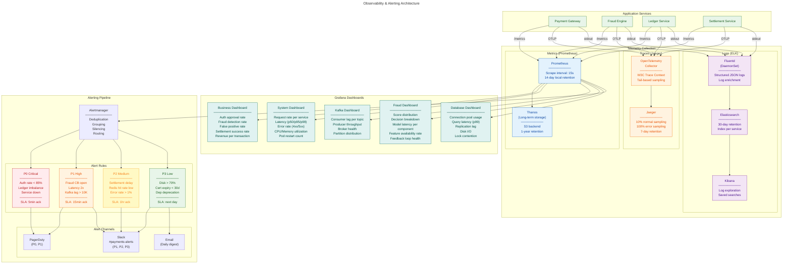

```mermaid
---
title: Observability & Alerting Architecture
---
graph TB
    subgraph Services["Application Services"]
        PG["Payment Gateway"]
        FE["Fraud Engine"]
        LS["Ledger Service"]
        SS["Settlement Service"]
    end

    subgraph Collection["Telemetry Collection"]
        subgraph Metrics["Metrics (Prometheus)"]
            PROM["Prometheus\n──────────\nScrape interval: 15s\n14-day local retention"]
            THANOS["Thanos\n(Long-term storage)\n──────────\nS3 backend\n1-year retention"]
        end
        
        subgraph Traces["Traces (Jaeger)"]
            OTEL["OpenTelemetry\nCollector\n──────────\nW3C Trace Context\nTail-based sampling"]
            JAEG["Jaeger\n──────────\n10% normal sampling\n100% error sampling\n7-day retention"]
        end
        
        subgraph Logs["Logs (ELK)"]
            FLUENTD["Fluentd\n(DaemonSet)\n──────────\nStructured JSON logs\nLog enrichment"]
            ES["Elasticsearch\n──────────\n30-day retention\nIndex per service"]
            KIB["Kibana\n──────────\nLog exploration\nSaved searches"]
        end
    end

    subgraph Dashboards["Grafana Dashboards"]
        D_BIZ["Business Dashboard\n─────────────────\nAuth approval rate\nFraud detection rate\nFalse positive rate\nSettlement success rate\nRevenue per transaction"]
        
        D_SYS["System Dashboard\n────────────────\nRequest rate per service\nLatency (p50/p95/p99)\nError rate (4xx/5xx)\nCPU/Memory utilization\nPod restart count"]
        
        D_KAFKA["Kafka Dashboard\n───────────────\nConsumer lag per topic\nProducer throughput\nBroker health\nPartition distribution"]
        
        D_FRAUD["Fraud Dashboard\n──────────────\nScore distribution\nDecision breakdown\nModel latency per component\nFeature availability rate\nFeedback loop health"]
        
        D_DB["Database Dashboard\n─────────────────\nConnection pool usage\nQuery latency (p99)\nReplication lag\nDisk I/O\nLock contention"]
    end

    subgraph Alerting["Alerting Pipeline"]
        AM["Alertmanager\n────────────\nDeduplication\nGrouping\nSilencing\nRouting"]
        
        subgraph Channels["Alert Channels"]
            PD["PagerDuty\n(P0, P1)"]
            SLACK["Slack\n#payments-alerts\n(P1, P2, P3)"]
            EMAIL["Email\n(Daily digest)"]
        end
        
        subgraph AlertRules["Alert Rules"]
            P0["P0 Critical\n──────────\nAuth rate < 85%\nLedger imbalance\nService down\n──────────\nSLA: 5min ack"]
            P1["P1 High\n──────────\nFraud CB open\nLatency 2x\nKafka lag > 10K\n──────────\nSLA: 15min ack"]
            P2["P2 Medium\n──────────\nSettlement delay\nRedis hit rate low\nError rate > 1%\n──────────\nSLA: 1hr ack"]
            P3["P3 Low\n──────────\nDisk > 70%\nCert expiry < 30d\nDep deprecation\n──────────\nSLA: next day"]
        end
    end

    PG & FE & LS & SS -->|"/metrics"| PROM
    PG & FE & LS & SS -->|"OTLP"| OTEL
    PG & FE & LS & SS -->|"stdout"| FLUENTD

    PROM --> THANOS
    PROM --> D_BIZ & D_SYS & D_KAFKA & D_FRAUD & D_DB
    OTEL --> JAEG
    FLUENTD --> ES --> KIB

    PROM --> AM
    AM --> P0 & P1 & P2 & P3
    P0 --> PD
    P1 --> PD & SLACK
    P2 --> SLACK
    P3 --> SLACK & EMAIL

    classDef service fill:#e8f5e9,stroke:#2e7d32,color:#1b5e20
    classDef metrics fill:#e3f2fd,stroke:#1565c0,color:#0d47a1
    classDef traces fill:#fff3e0,stroke:#ef6c00,color:#e65100
    classDef logs fill:#f3e5f5,stroke:#7b1fa2,color:#4a148c
    classDef dashboard fill:#e0f2f1,stroke:#00695c,color:#004d40
    classDef alert_crit fill:#ffebee,stroke:#c62828,color:#b71c1c
    classDef alert_high fill:#fff3e0,stroke:#ef6c00,color:#e65100
    classDef alert_med fill:#fff9c4,stroke:#f9a825,color:#f57f17
    classDef alert_low fill:#e8f5e9,stroke:#2e7d32,color:#1b5e20

    class PG,FE,LS,SS service
    class PROM,THANOS metrics
    class OTEL,JAEG traces
    class FLUENTD,ES,KIB logs
    class D_BIZ,D_SYS,D_KAFKA,D_FRAUD,D_DB dashboard
    class P0 alert_crit
    class P1 alert_high
    class P2 alert_med
    class P3 alert_low
```
