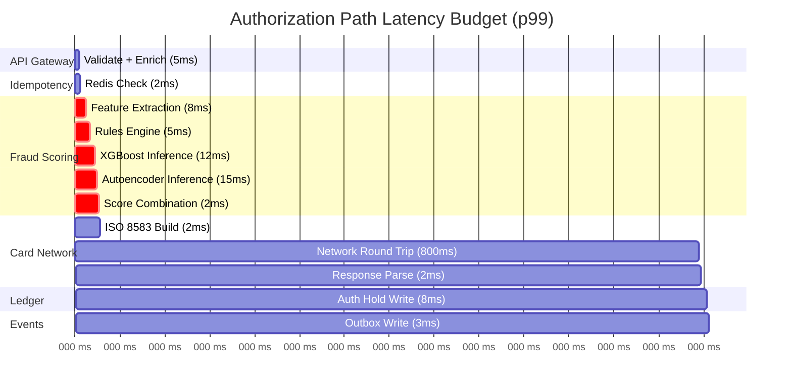

```mermaid
---
title: Authorization Latency Budget
---
gantt
    title Authorization Path Latency Budget (p99)
    dateFormat X
    axisFormat %L ms

    section API Gateway
    Validate + Enrich (5ms)           :a1, 0, 5

    section Idempotency
    Redis Check (2ms)                  :a2, 5, 7

    section Fraud Scoring
    Feature Extraction (8ms)           :crit, a3, 7, 15
    Rules Engine (5ms)                 :crit, a4, 15, 20
    XGBoost Inference (12ms)           :crit, a5, 15, 27
    Autoencoder Inference (15ms)       :crit, a6, 15, 30
    Score Combination (2ms)            :crit, a7, 30, 32

    section Card Network
    ISO 8583 Build (2ms)               :a8, 32, 34
    Network Round Trip (800ms)         :a9, 34, 834
    Response Parse (2ms)               :a10, 834, 836

    section Ledger
    Auth Hold Write (8ms)              :a11, 836, 844

    section Events
    Outbox Write (3ms)                 :a12, 844, 847
```
